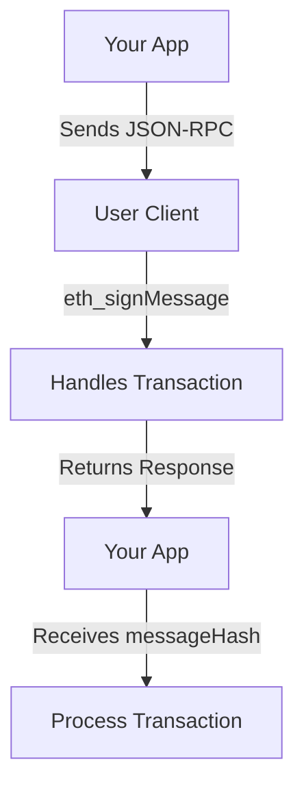

# Intersend - Portability with Iframe

**Portability** is the foundation of cross-app connectivity. This repository provides a simple and effective method to enable iframe communications, allowing your app to become instantly compatible with Intersend's ecosystem. By implementing iframe communication standards, your app can seamlessly exchange messages with parent applications and handle off-chain transactions securely.

This repo demonstrates how to easily integrate iframe messaging to handle requests like `eth_signMessage` and securely receive responses for onchain transactions.

- **Full documentation**: [https://intersend.mintlify.app/](https://intersend.mintlify.app/)
- **App examples**: [https://github.com/intersend/app-examples](https://github.com/intersend/app-examples)
- **Contact**: hello@intersend.io, Telegram: [@erturkarda](https://t.me/erturkarda)

---

## How It Works

The app sends an `eth_signMessage` request to the parent iframe using standard JSON-RPC. The parent iframe processes the request and returns an `SignMessageResponse`, which includes a `messageHash`. The helper code in this repository listens for that response and handles it efficiently.

